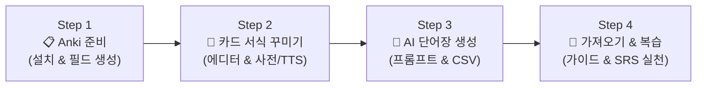

# 🌄 Study with Wanzi - 다국어 Anki 학습 도구 모음

> **"비개발자도 10분 만에 끝내는 나만의 Anki 단어장 시스템"**  
> Anki 카드 꾸미기부터 AI 단어장 추출, 매일 복습하는 방법까지 — 복잡한 설정 없이 브라우저에서 바로 사용하는 올인원 무료 웹 툴킷입니다.

[](https://wanzi-study.github.io/studyWithWanzi/)
[](LICENSE)
[](#-기술-스택-및-설계-철학)
[](#-다국어-i18n-지원)

---

## 📖 프로젝트 배경 (Why Study with Wanzi?)

**Anki(안키)**는 망각 곡선 이론에 기반한 간격 반복(SRS, Spaced Repetition System) 알고리즘을 사용하는 세계 최강의 언어 암기 도구입니다. 전 세계 수많은 어학 학습자와 의대생들이 필수로 사용하지만, **비개발자에게는 진입 장벽이 매우 높습니다.**

* ❌ HTML/CSS 코드를 직접 만져야 하는 복잡한 카드 서식 설정
* ❌ 단어 뜻을 찾기 위해 매번 브라우저와 Anki 앱을 오가는 번거로움
* ❌ AI(ChatGPT, Claude, Gemini)에게 단어를 뽑아달라고 해도 표 형식이 깨지거나 쉼표 분리 오류 발생
* ❌ 엑셀이나 메모장에서 CSV를 잘못 저장해 한글/외국어가 깨지는 UTF-8 인코딩 문제
* ❌ "노트"와 "카드", "필드"의 개념 차이로 인한 혼란

**Study with Wanzi**는 이러한 어려움을 완전히 해결하기 위해 만들어졌습니다.  
코딩이나 설치, 회원가입 없이 브라우저에서 버튼 몇 번으로 예쁜 단어 카드를 만들고, AI를 이용해 클릭 한 번으로 Anki에 쏙 들어가는 단어장 파일(CSV)을 생성할 수 있습니다.

---

## 🗺️ 4단계 학습 여정 (User Journey)

Study with Wanzi는 비개발자 학습자가 길을 잃지 않도록 직관적인 4단계 프로세스를 제공합니다.



1. **Step 1: Anki 준비 (`ankiGuide.html#fields`)**  
   - PC Anki 설치 및 무료 AnkiWeb 동기화 설정
   - 단어 정보를 담을 5대 핵심 필드(`의미`, `단어`, `발음`, `예문`, `예문해석`) 구성
2. **Step 2: 카드 서식 꾸미기 (`ankiEditor.html`)**  
   - 학습 언어 선택 시 해당 언어의 공식 네이버 사전 링크 및 발음 재생(TTS) 자동 연동
   - 테마 프리셋과 실시간 시뮬레이터로 예쁜 디자인 완성
   - ① 앞면 서식, ② 뒷면 서식, ③ 스타일 코드를 번호 순서대로 Anki에 복사/붙여넣기
3. **Step 3: AI로 단어장 만들기 (`ankiPrompt.html`)**  
   - 시험 등급(HSK, JLPT, CEFR, TOEIC 등)에 맞춘 맞춤형 프롬프트 생성
   - AI 답변을 붙여넣으면 Anki 전용 CSV 파일로 1초 만에 변환 및 다운로드
4. **Step 4: 가져오기 · 복습 (`ankiGuide.html#learning`)**  
   - PC Anki에서 CSV 가져오기 및 필드 매핑
   - 망각 곡선을 극대화하는 덱 옵션 설정 및 4단계 복습 버튼 완벽 가이드

---

## 🌟 핵심 도구 및 주요 기능

### 1. 🌄 Anki 카드 서식 에디터 (`ankiEditor.html`)
> 복사해서 붙여넣기만 하면 사전 바로가기 아이콘과 음성 재생이 달린 카드가 완성됩니다.

* **46개 언어 공식 네이버 사전 원클릭 매핑**: 영어, 일본어, 중국어부터 아랍어, 스페인어, 베트남어 등 46개 언어 지원. 단어 옆에 `🌐 외국어사전`, `📘 국어사전` 아이콘 자동 삽입.
* **Anki 내장 음성 재생 (TTS) 지원**: 기기 목소리로 단어를 읽어주는 `{{tts lang:Field}}` 태그 및 속도(보통/조금 느리게/느리게) 설정.
* **원클릭 감성 디자인 테마**:
  * 🤍 기본 (모던 & 심플)
  * 🏷️ 링 단어장 (아날로그 줄무늬 플래시카드 & 그림자)
  * 🟨 스티키 메모 (포스트잇 파스텔 옐로우 & 점선)
  * 🌿 세이지 포레스트 (눈이 편안한 북유럽풍 세이지 그린)
  * 📒 종이 노트 (줄노트 느낌의 페이퍼)
  * 🌸 파스텔 (화사한 그라데이션)
  * 🖤 고급 다크 (골드 포인트 다크모드)
  * 🟩 칠판 (아늑한 분필 감성)
  * 🌊 바다 (청량한 오션 테마)
  * 📊 스프레드시트 (깔끔한 표 형태)
  * 📜 전통 테마 모음 (한지, 오방색, 단청, 태극, 조각보, 청자, 자개 등)
* **세부 디자인 커스터마이징**:
  * 단색 / 그라데이션 / 은은한 무늬(점, 격자, 줄노트, 한지) 배경
  * 둥근 카드, 그림자 효과, 테두리, 정답 구분선(실선, 점선, 이중선)
  * 기기 내장 폰트(고딕, 명조, 타자기체) 지원으로 인터넷 없이도 동일 렌더링 보장
* **실시간 양방향 시뮬레이터**:
  * 카드 앞면/뒷면 뒤집기(🔄) 및 라이트/다크 모드(🌙) 실시간 확인
  * 미리보기 카드의 글자를 클릭하면 해당 필드의 스타일을 즉시 수정하는 **글씨 인스펙터**
* **초보자를 위한 친절한 복사 도우미**:
  * ① 앞면 서식 ➔ ② 뒷면 서식 ➔ ③ 스타일 번호 매김 및 복사 완료 체크(✓) 표시

---

### 2. 🤖 Anki AI 프롬프트 생성기 (`ankiPrompt.html`)
> AI(ChatGPT · Gemini · Claude)를 나만의 단어장 비서로 만들어 줍니다.

* **어학 시험 등급별 정밀 필터링**:
  * 영어 (토익, 토플, 텝스, 지텔프, 아이엘츠, 수능)
  * 일본어 (JLPT N1~N5)
  * 중국어 (HSK 1~6급)
  * 유럽 언어 (CEFR A1~C2, DELF, 괴테, DELE, CILS 등)
  * 원하는 급수 이하 쉬운 단어 제외 / 해당 급수 단어만 추출
* **2가지 생성 모드**:
  * 📄 **본문 추출 모드**: 내가 가진 외국어 기사, 대본, 원서 지문에서 핵심 단어만 추출
  * 💡 **주제 생성 모드**: 상황(예: 공항 수속, 병원 진료, 식당 주문)만 입력하면 AI가 단어장 자동 구성
* **원클릭 AI 서비스 실행**: 프롬프트 자동 복사와 함께 ChatGPT, Gemini, Claude 바로가기 지원.
* **스마트 CSV 변환 및 다운로드 (순수 브라우저 처리)**:
  * AI 답변의 인사말, 마크다운 코드블록(```) 자동 정제
  * Anki 특화 메타데이터(`#separator:Comma`, `#html:true`) 자동 삽입
  * 엑셀 없이도 한글/특수문자/성조가 절대 깨지지 않는 UTF-8 CSV 파일 즉시 다운로드

---

### 3. 📖 Anki 완전 정복 가이드 (`ankiGuide.html`)
> 처음 쓰는 분도 스크린샷과 함께 따라 할 수 있는 4단계 시각 가이드입니다.

* **친절한 단계별 설명**: PC 설치부터 필드 생성, 서식 붙여넣기, CSV 가져오기, 복습 요령까지 체계적 정리
* **실제 UI 스크린샷 포함**: Anki 프로그램 화면과 1:1로 매칭되는 시각적 안내
* **검증된 학습법 팁**:
  * 왜 새 카드는 하루 10~20장만 해야 하는가?
  * 왜 최대 복습량은 줄이지 말고 9999로 두어야 하는가?
  * 4가지 복습 버튼(다시/어려움/알맞음/쉬움)의 올바른 선택 기준
* **자주 묻는 질문(FAQ)**: 동기화 충돌, 모바일 음성 미지원, CSV 칸 어긋남 문제 등 상세 해결법 수록

---

## 🛠️ 기술 스택 및 설계 철학

| 영역 | 사용 기술 및 방식 | 비고 |
|:---|:---|:---|
| **Frontend** | HTML5, CSS3, Vanilla JavaScript (ES6+) | 빌드/번들러 없는 순수 웹 표준 |
| **Styling** | Modern CSS Variables, Flexbox/Grid, CSS Theme Engine | 경량화 및 부드러운 반응형 |
| **Storage** | Client-side `localStorage` | 서버 없음, 개인정보 수집 없음 |
| **i18n** | 자체 경량 다국어 라우터 (`assets/js/i18n.js`) | 한국어(ko), 영어(en), 중국어(zh) |
| **Hosting** | GitHub Pages (정적 호스팅) | 어디서나 접속 가능한 완전 무료 배포 |

### 설계 철학
1. **Zero Setup & Zero Dependency**:
   - `npm install`이나 빌드 도구(Vite, Webpack)가 전혀 필요 없습니다.
   - HTML 파일을 더블 클릭하기만 해도 브라우저에서 100% 정상 작동합니다.
2. **비개발자를 위한 직관성 (Pit of Success)**:
   - 전문적인 기술 용어 대신 직관적인 한글 표현 사용 (`필드` ➔ `카드에 들어갈 칸`, `구분자` ➔ `칸 나누는 기호`).
   - 잘못 입력하더라도 오류가 발생하지 않도록 자동 정제 및 방어 로직 내장.
3. **철저한 프라이버시 보호**:
   - 사용자가 입력한 학습 단어나 문장은 외부 서버로 절대 전송되지 않고 브라우저 로컬에만 보관됩니다.

---

## 📁 프로젝트 폴더 구조

```text
studyWithWanzi/
├── index.html                   # 메인 허브 포털 (4단계 시작 경로 및 도구 소개)
├── ankiEditor.html              # Anki 카드 서식 에디터 (스타일, 테마, 사전/TTS)
├── ankiPrompt.html              # Anki AI 프롬프트 생성기 (난이도 선택 및 CSV 변환)
├── ankiGuide.html               # Anki 완전 정복 가이드 (단계별 안내 & FAQ)
├── deco_theme_default.txt       # 기본 서식 백업 및 참조용 코드
├── _config.yml                  # GitHub Pages 배포 설정
├── README.md                    # 프로젝트 안내 문서
├── VIBE_CODING.md               # AI 바이브 코딩 및 유지보수를 위한 가이드 문서
│
├── assets/
│   ├── css/
│   │   ├── style.css            # 공통 테마, 레이아웃, 모바일 내비게이션
│   │   ├── index.css            # 허브 포털 전용 스타일
│   │   ├── editor.css           # 에디터 전용 컴포넌트 & 인스펙터 스타일
│   │   ├── prompt.css           # 프롬프트 생성기 & CSV 다운로드 카드 스타일
│   │   └── guide.css            # 가이드북 전용 레이아웃 & 콜아웃 박스 스타일
│   │
│   ├── js/
│   │   ├── languages.js         # 46개 언어 데이터 및 공식 사전 링크 매핑
│   │   ├── langCombobox.js      # 초성 검색 및 별칭 지원 언어 선택 콤보박스
│   │   ├── i18n.js              # 다국어(ko/en/zh) 번역 렌더링 엔진
│   │   ├── app.js               # 카드 에디터 메인 로직 (실시간 렌더링, 테마, 복사)
│   │   └── promptApp.js         # AI 프롬프트 생성기 로직 (프롬프트 빌더, CSV 생성)
│   │
│   ├── i18n/                    # 다국어 번역 사전
│   │   ├── ko/                  # 한국어 (기본 언어)
│   │   ├── en/                  # 영어
│   │   └── zh/                  # 중국어
│   │
│   └── images/
│       └── guide/               # 가이드북 스크린샷 이미지 (01~06 PNG)
```

---

## 💻 실행 및 배포 방법

### 1. 가장 쉬운 방법 (로컬 더블 클릭)
* 저장소를 다운로드한 후, 폴더 안의 **`index.html`** 파일을 더블 클릭하면 웹 브라우저(Chrome, Edge, Safari, Whale 등)에서 즉시 열립니다.

### 2. 온라인 웹 접속 (GitHub Pages)
* [https://wanzi-study.github.io/studyWithWanzi/](https://wanzi-study.github.io/studyWithWanzi/) (또는 본인 저장소의 GitHub Pages 주소)

### 3. 로컬 개발 서버 실행 (선택 사항)
* VS Code의 **Live Server** 확장 사용: `index.html` 우클릭 ➔ **Open with Live Server**
* Python 사용: 터미널에서 `python -m http.server 8000` 입력 후 브라우저에서 `http://localhost:8000` 접속

---

## 🌐 다국어 (i18n) 지원

화면 우측 상단의 언어 선택기를 통해 즉시 UI 언어를 변경할 수 있습니다:
* 🇰🇷 **한국어 (Korean)** - 기본 제공
* 🇺🇸 **English** - Full UI translation
* 🇨🇳 **中文 (Chinese Simplified)** - 全界面中文支持

---

## 🤝 기여 및 피드백

버그 제보, 새로운 사전 링크 제안, 디자인 테마 추가 아이디어는 언제나 환영합니다!
* Issue 등록 또는 Pull Request를 남겨주세요.
* AI 기반 바이브 코딩(Vibe Coding)으로 본 프로젝트를 수정하거나 확장하려는 분은 **[`VIBE_CODING.md`](VIBE_CODING.md)** 문서를 반드시 먼저 확인해 주세요.

---

## 📄 라이선스

이 프로젝트는 [MIT License](LICENSE)에 따라 자유롭게 사용 및 수정할 수 있습니다.  
Made with care for language learners. © 2026 Study with Wanzi.
